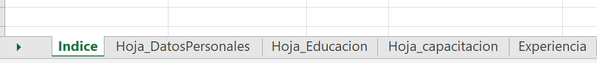

---
authors:
- admin
categories:
- python
date: "2020-12-13T00:00:00Z"
draft: false
featured: false
image:
  caption: ''
  focal_point: ""
  preview_only: false
lastmod: "2020-12-13T00:00:00Z"
projects: []
subtitle: "En la mayoria de postulaciones laborales es muy comun que se requiera cv-documentado. Sin embargo, la tarea de organizar toda la documentación puede ser tedioso. Este post, te ayudará a generar un cv documentado de manera automática usando python."
summary: "App para generar un cv documentado"
tags:
- python
- cv
- curriculum vitae
title: CV documentado con Python
---

## Outline - Excel
El primer paso de este proceso es definir el índice de nuestro cv, para lo cual, una buena alternativa es un documento spreadsheet ("Template_CV.xlsx"). Este documento debe tener tiene que tener la hoja **"Índice"** (como se muestra en la  figura)


esta hoja contiene:
1. **Página:** Nombre de hoja excel donde estarán organizados los datos
    
2. **Título:** Título de la Sección con el que irá el CV final

3. **Orden:** Órden en que se listará en el CV final
4. **Planilla:** Plantilla que se usará para estructurar la sección.

En el caso de la *Planilla* se tiene 3 alternativas:
- Información_personal
  
- Título_Anho
 
- Lista_items (Lista simple del contenido)
  


## Organización documentos pdf
Todos los documentos mencionados en las columnas **LinkDocumento** del archivo *Template_CV.xlsx* tienen que estar contenidos en la carpeta **pdf_files** en formato PDF.

## Ejecución
El código consta de 3 archivos python: 
- **Merge_PDF.py** : Genera la compilación de los documentos pdf
- **putNumber.py** : Coloca número de página a los PDFs
- **CV_Maker.py**  : Archivo principal que genera el *.docx y *.pdf 

Para la ejecución se posiciona en la carpeta y ejecutar el comando:
```cmd
python Merge_PDF.py
```

## Resultado
Una vez ejecutado, se generarán 2 archivos en la carpeta *CV_Template_result.docx* y *CV_Combinado.pdf*


*CV_Template_result.docx* contiene la información del Curriculum mientras *CV_Combinado.pdf* contiene los documentos ordenado basado en la información de *Template_CV.xlsx*. 

*CV_Template_result.docx* puede ser alterado a preferencia del usuario, y una vez convertido a pdf, se puede utilizar aplicaciones como *PDFsam* para combinar los 2 archivos. En caso de no usar el número de página, puede usar el archivo *temp.pdf*

## Código
El código completo se puede encontrar en el siguiente [**Link**](https://github.com/germaingarcia/CV_documentado_python)

